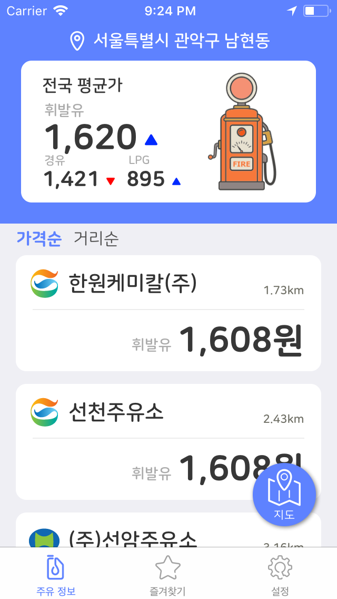
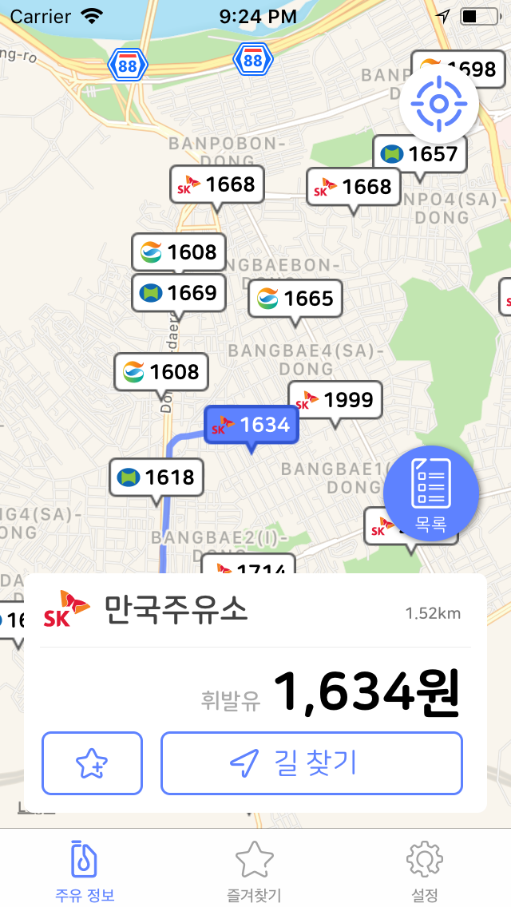
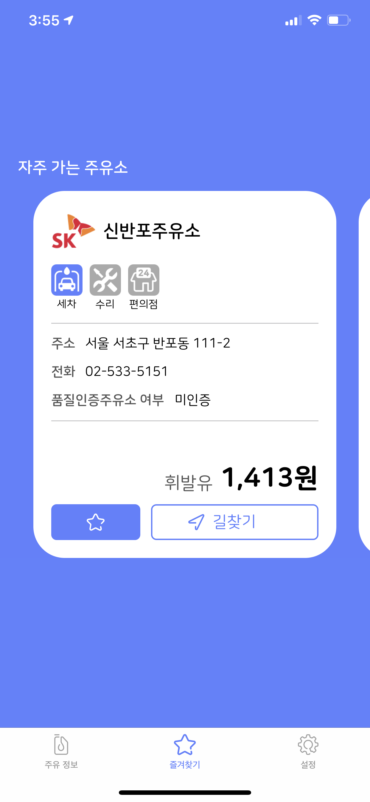
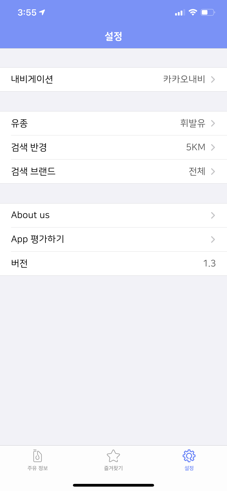

# 어디주유 Where Gas Stations

 

 

## Member

- 안솔찬
    - mail: perudot@gmail.com  
    - github: https://github.com/solchan87
- 박상욱
    - mail: wkahdla12346@gmail.com 
    - github: https://github.com/wargi
- 박힘찬
    - mail: ting1099@gmail.com 
    - github: https://github.com/himchanPark

 

## Content

- [About Applications](#about-applications)
- [Preview](#preview)
- [Version History](#version-history)
- [Download](#download)
- [What we learned on this project](#what-we-learned-on-this-project)

 

## About Applications

- 프로젝트 기간: 18.07 ~ 18.08
- 사용자에게 가까운 거리의 주유소 중 합리적인 가격의 주유소를 찾아 안내해주는 어플
- 필요 권한: 위치정보 사용 권한(현재위치 기반 정보 검색)
- 어플의 기능
>- 현재위치에서 주변의 주유소의 목록을 리스트 표시
>- 현재위치에서 주변의 주유소의 목록을 지도의 마커로 표시해주며 간략한 주위 정보 제공
>- 가격순/거리순 정렬 기능
>- 길안내시 카카오네비게이션 연동 기능
>- 즐겨찾기 설정
>- 즐겨찾기 설정한 주유소의 상세정보 표시
>- 주유소 브랜드별 검색 기능
>- 거리별로 주유소 탐색 기능(1,3,5KM 중 선택)
>- 오일타입별로 주유소 탐색 기능(휘발유,경유,LPG,고급휘발유 중 선택)
>- 실시간 전국 평균가 정보 표시(휘발유,경유,LPG)

 

## Preview

<a href="https://vimeo.com/288497922"> 어플 실행 영상 </a>  기능 추가 

## Version History

- ver 1.0.0 : App Store Release(18.09.07)
- ver 1.0.1 : Bug fixes Debug(18.09.09)
- ver 1.1.0 : Add Function Release(19.01.04)
- ver 1.2.0 : Bug fixes Dubug & Add Function Release()

 

## Download

 

## What we learned on this project

- Core Location
- MapKit
- App Delegate Life Cycle & When use App Delegate Function
- Collaboration using Git(VCS)
- Json Data Parsing(Codable)
- Passing data between ViewControllers using segue
- Reuse TableviewCell
- Save user setting data(Plist)
- Application state as network state changes
- Depending on your location rights, the application state
- Autolayout by device

 
