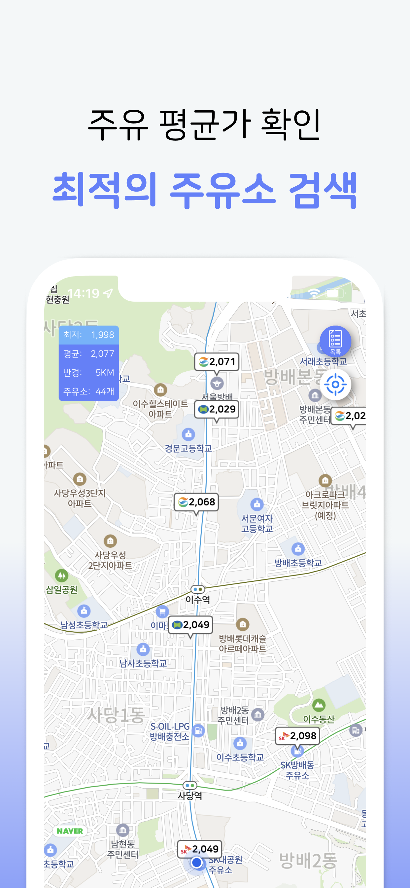
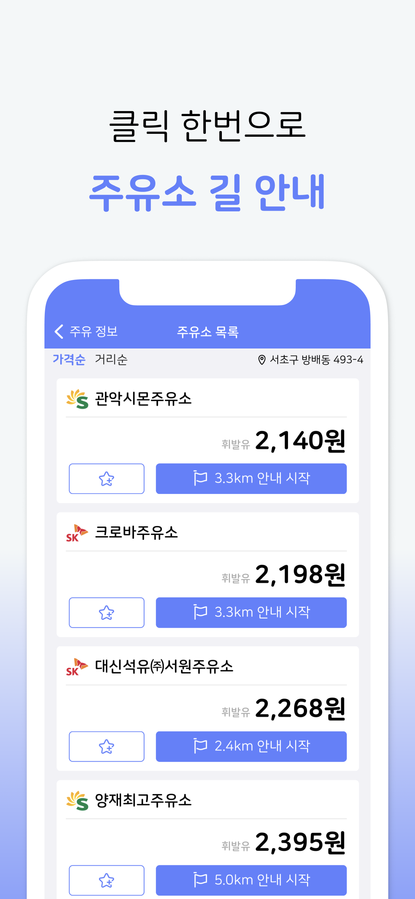
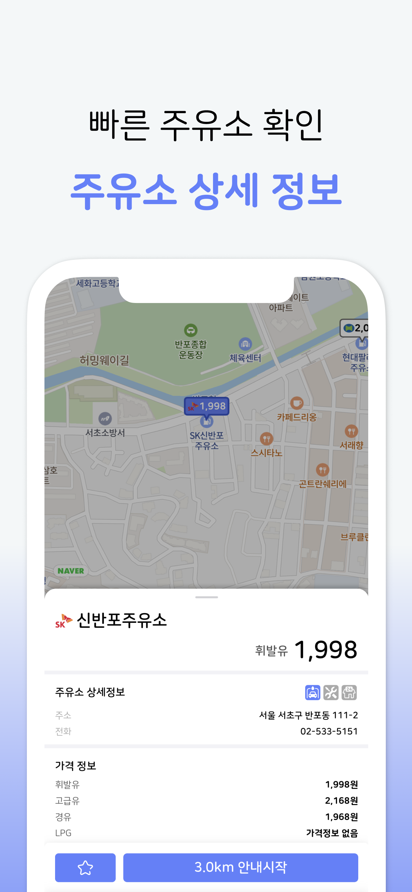

# 어디주유

 

 

## About

- **사용자 위치 기반 합리적인 가격의 주변 주유소를 찾아 안내해주는 어플**
- **필요 권한** 
    - 위치정보 사용 권한

- **기능**
    - 위치 기반 주변 주유소 검색
    - 내비게이션 연동
    - 즐겨찾는 주유소 설정
    - 주유소 상세정보

 

## Preview

<a href="https://youtu.be/2Oaj9Mj7jUk"> 어플 실행 영상 </a>

 

## Download

