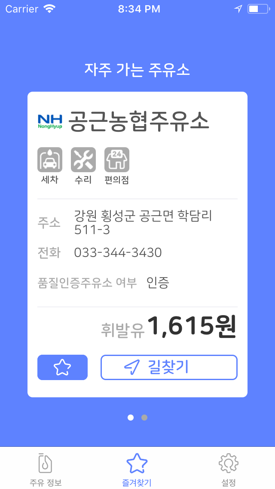
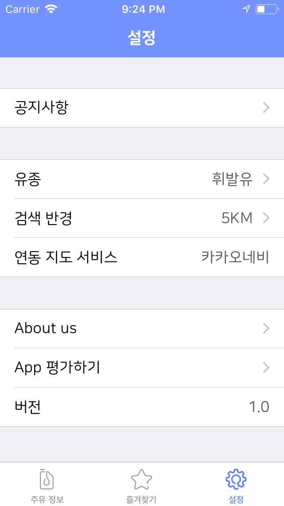

## 어디주유 Where gas stations(Team ATP)

   

 

## Member
- 안솔찬
    - mail: perudot@gmail.com  
    - github: https://github.com/solchan87
- 박상욱
    - mail: wkahdla12346@gmail.com 
    - github: https://github.com/wargi
- 박힘찬
    - mail: ting1099@gmail.com 
    - github: https://github.com/himchanPark

 

## Content
- [About Applications](#About-Applications)
- [Preview](#Preview)
- [Version History](#Version-History)
- [Download](#Download)
- [What we learned on this project](#What-we-learned-on-this-project)

 

## About ApplicationsContent

- 프로젝트 기간: 18.07 ~ 18.08
- 사용자에게 가까운 거리의 주유소 중 합리적인 가격의 주유소를 찾아 안내해주는 어플
- 필요 권한: 위치정보 사용 권한(현재위치 기반 정보 검색)
- 어플의 기능
>- 현재위치에서 주변의 주유소의 목록을 리스트와 지도의 마커로 표시
>- 가격순/거리순 정렬 기능
>- 길안내시 카카오네비게이션 연동 기능
>- 즐겨찾기 설정
>- 즐겨찾기 설정한 주유소의 상세정보 표시
>- 거리별로 주유소 탐색 기능(1,3,5KM 중 선택)
>- 오일타입별로 주유소 탐색 기능(휘발유,경유,LPG,고급휘발유 중 선택)
>- 실시간 전국 평균가 정보 표시(휘발유,경유,LPG)

 

## Preview

<a href=""> 어플 실행 영상 </a>   

## Version History
- ver 1.0.0 : App Store release(미정)

 

## Download

 

## What we learned on this project

 
